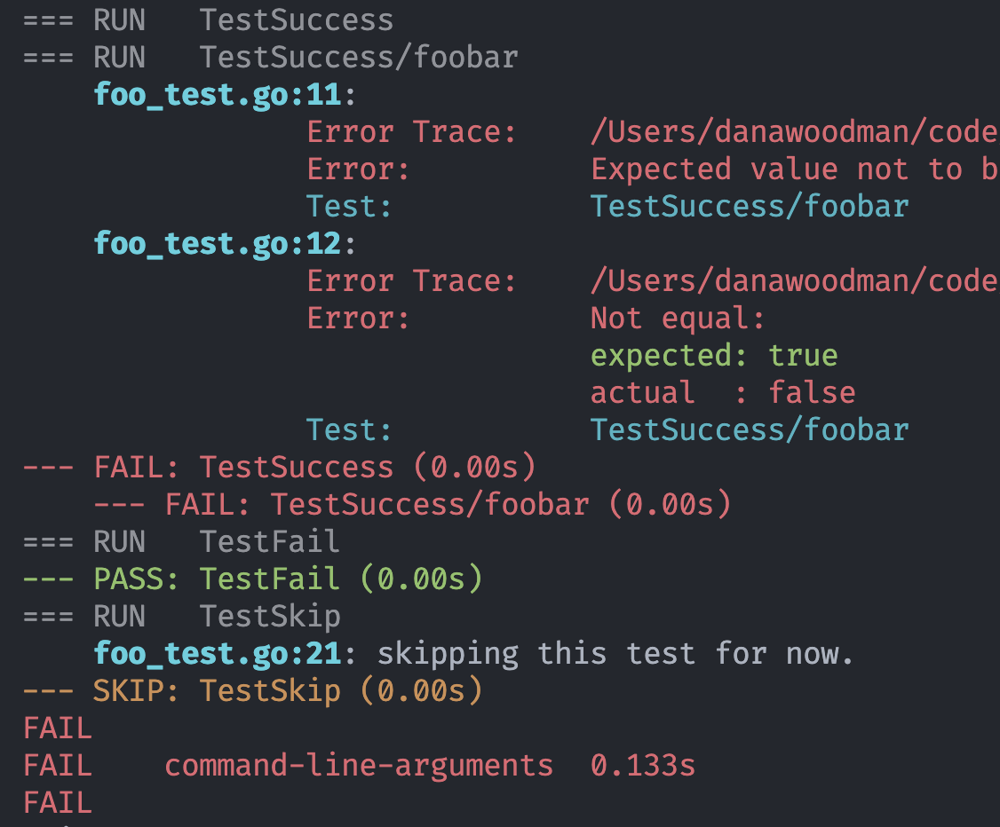

# gtc - golang test colors

> A simple colorizer wrapper for the `go test` command

Go's default test output is uncolored and can be hard to read. This simple wrapper adds color to the output by piping the stdout and stderr of the `go test` command and outputting ansii colorized text.



This should work on any platform that supports ansii color codes, including Windows.

gtc uses your system's `go` command to run tests, so it should work with any version of Go.

## Installation

Download a [release](https://github.com/danawoodman/gtc/releases) for your platform and add it to your path.

Or just install with Golang:

```bash
go install github.com/danawoodman/gtc@latest
```

## Usage

Just replace `go test` with `gtc` in your test commands. All flags will be passed as-is to `go test`.

```bash
# single test run
gtc ./...

# with flags
gtc -v ./...
```

## License

[MIT](LICENSE)
